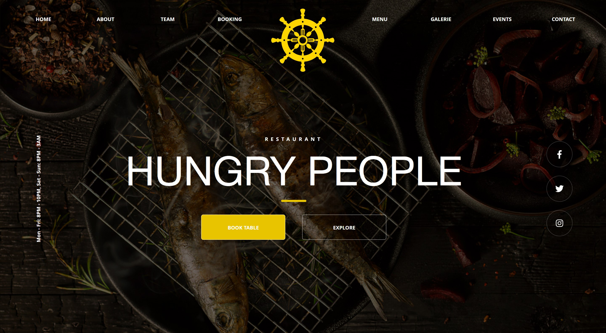
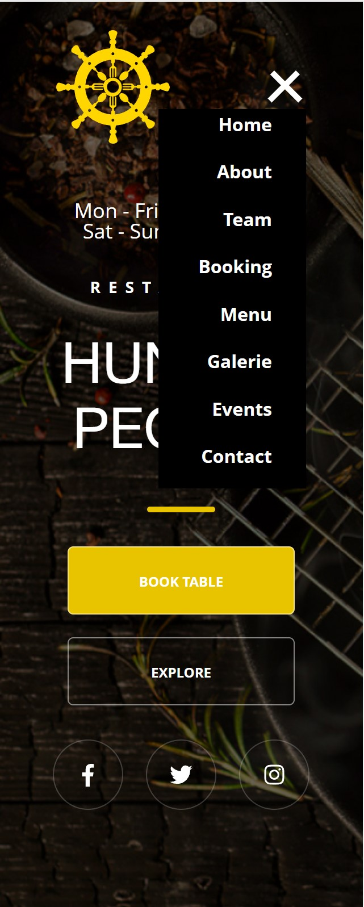

<h1 align="center">Hungry People</h1>

<h2 align="left">Описание проекта</h2>

Цель создания проекта - отработка навыков адаптивной верстки, создание бургерного меню, тренировка базовых навыков работы с JavaScript.

Проект **Hungry People** является одностраничным лендингом ресторана, **адаптированным** под разрешение экранов разного размера.

При заполнении форм появляются подтверждающие попапы. 

Также в проекте реализовано **бургерное меню** для мобильных экранов. Иконка меню анимирована.

  

Просмотреть проект можно на GitHub Pages по ссылке:

Макет проекта был предоставлен наставником Яндекс.Практикума Максимом Чеченевым.

Окончание проекта - февраль 2022 года.

<h2 align="left">Использованные технологии</h2>

Страница проекта стилизована с помощью **CSS**. 

Страница адаптирована под экраны с разным разрешением с помощью **адаптивной верстки и медиазапросов**. Вид страницы при разрешениях экрана менее 1440px подбирался автором проекта самостоятельно.

Для создания бургерного меню и всплывающих попапов использовался **JavaScript**.

При разработке и организации файлов использовалась **БЭМ** методология.

<h2 align="left">Планы по доработке проекта:</h2>

- улучшить секцию с меню, добавить перерисовку меню при выборе разных типов блюд;
- добавить страницу с галереей фотографий.
